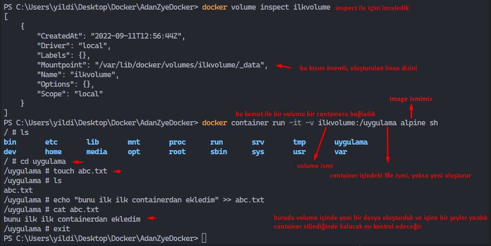

# Docker

- Docker CLI (Command Line Interface)

`docker version` komutu ile client ve server Docker engine kontrol ediliyor, bu komutu powershell(windowsda, mac de terminal) ile calistirdik, asagıda belirtilen ekran gelmeli

```
Client:
 Cloud integration: v1.0.28
 Version:           20.10.17
 API version:       1.41
 Go version:        go1.17.11
 Git commit:        100c701
 Built:             Mon Jun  6 23:09:02 2022
 OS/Arch:           windows/amd64
 Context:           default
 Experimental:      true

Server: Docker Desktop 4.11.1 (84025)
 Engine:
  Version:          20.10.17
  API version:      1.41 (minimum version 1.12)
  Go version:       go1.17.11
  Git commit:       a89b842
  Built:            Mon Jun  6 23:01:23 2022
  OS/Arch:          linux/amd64
  Experimental:     false
 containerd:
  Version:          1.6.6
  GitCommit:        10c12954828e7c7c9b6e0ea9b0c02b01407d3ae1
 runc:
  Version:          1.1.2
  GitCommit:        v1.1.2-0-ga916309
 docker-init:
  Version:          0.19.0
  GitCommit:        de40ad0
```

client o isletim sistemini baz alarak kuruluyor, server ise linux isletim sistemli sanal makine kurularak deamen buraya kuruluyor.

client win da deamon ise linuxda calisiyor.

`docker info` komutu ile de sistemde docker ile ilgili temel bilgilere ulaşıyoruz. 


`docker` komutu ile de docker komutlarını gorebiliriz.

- bu komutlar 3 ana baslik altında toplanmistir. Options, Managment Commands, Commands 

- 2017 yilinda itibaren <docker "yönetilmek istenilen bolum" "komut"> seklinde komutlari yaziyoruz  

örnek => `docker container run hello-word` 

örnek => `docker image --help` yazarsak image ile ilgili yazabilcegimiz komutlar gelmektedir.

---

**Container Temelleri-1**


`docker container create` ile container oluşturuluyor, `start` ile baslatılıyor,
bu islemleri tek seferde yapabilmek icin `docker container run` kullanılıyor

- komut ile cagrilan image localde yoksa docker hub tan cagrilir.

`docker container ls -a` komutu ile tüm calisan kapatilmis containerları gorüyoruz.


- Her container imajında, o imajdan bir container yarattıgımiz zaman varsayılan olarak calısması icin ayarlanmıs bir uygulama vardır.

- bu uygulama calıştigi sürece container ayakta kalır

- uygulama calismayi biraktiginda container da kapatilir.

**Container Temelleri-2**

 soru-1: Docker imajlarında sadece tek bir uygulama mı vardır?

 Hayır. Docker imajında birden fazla uygulama olabilir. Tek bir uygulama içermesi kural değildir.

 soru-2: Docker, imajlarından container yaratıldığında çalışması için birden fazla uygulama atanabilir mi?

 Hayır. Docker container başlatıldığı zaman otomatik çalışması için tek bir uygulamanın ayarlanmasına izin verir.

soru-3 : Docker container içerisinde sadece tek bir uygulama mı çalıştırılabilir?

Hayır. Docker container başlatıldığı zaman otomatik çalışması için tek bir uygulamanın ayarlanmasına izin verir fakat container içerisinde daha sonra bu uygulamanın yanında başka uygulamaklar da çalıştırılabilir.

soru- 4: Docker image inda varsayılan olarak çalıştırılması için ayarlanan uygulama terine başka uygulama ile container başlatabiliyor muyuz?

Evet. Container yaratılırken hangi uygulamayı çalıştırılmasını belirtebiliriz.


```
docker container run --name deneme -d -p 80:80 ozgurozturknet/adanzyedocker
docker container run -p 80:80 dizin/imagename  
# 80:80 potunu acıp ilgili image baslattı container oluştu
# containerlar için uniq id üretilir

docker container ls
#bize calisan containerları gösterir

`docker container run --name denemecon dizin/imagename java app1`
# bu komut ile containeri default isim yerine kendi yazdigimiz ismi verdik, ayrıca baslatilan uygulama yerine son kısımda yazdığımız uygulayı baslattik.

docker container run -d -p 80:80 dizin/imagename
# bu komut ile arka planda container calisiyor, bizim shell mizi baglamadi.

docker container ls -a => docker ps -a
#calisan calismayan tüm containerlari gösterir

docker container rm idnumarasi
# containeri siler, calisan containeri silemez, fakat rm -f idnumra ile zorla silme yapabiliyoruz.

docker container stop f43
# calisan containeri durdurur. sondaki uc karakter id numarası basi

```


**Container Temelleri-3**

```
docker container run --name websunucu -p 80:80 -d ozgurozturknet/adanzyedocker

 docker container exec -it websunucu sh
# containeri bağlanma komutu, websunucu bizim proje ismi 

 ls -l  içindeki uygulamaları gördük ve isimlerini yazarak uygulamayı calıştirdik

 container a baglantı kurulduktandan sonra ps ile container içinde yüklü  appleri görüntüledik


docker container run --name websunucu2 -p 80:80 -d ozgurozturknet/adanzyedocker 
# bir containerdan aynı image kullanarak milyonlarca container oluşturulabiliyor

```


docker container prune # calısmayan tüm containerları siliyor
docker image ls # image gösteriyor
docker image prune -a # image siliyor
docker image pull alpine #

**Docker Katmanlı Dosya Yapısı**

- Docker Union File System (birlesik dosya sistemi)


- aynı image ile birçok container uretilebilir. Yapilan bu degisikler ayri bir katman olarak tutulur. Bu degisiklikten diger containerlar etkilenmez.

- ayri katmanlardan olusan container ls komutu ile tek bir dosya yapısında gibi görünür. Bu yapıya Union file system denir.

- Copy on Write

   - container içinde yapilan degisiklik image file icindeyse bu degisiklik yazılabilir katmana R/W Layer tasinir. 


- Not : İmage katmanli yapisi mevcut, docker aynı katmanlı olanları tek bir sefer hafizaya aliyor.

**Docker Container Yasam Suresi**

- Container bir sorun yasandiginda silinip yeniden kurulabilme ozelligi mevcuttur.Fiziksel makineler gibi uzaktan ulasip sorunu cozmuyoruz. direk siliyoruz :)


- Container i tek kullanımlık olarak dusunebiliriz.Eger proje icinde tutulan kayitlar/log ve db benzeri bir yapı varsa bu container icinde tutulmaz. Bunları ayri bir yerde yutuyoruz. Container disinda tutarak erisebilir ve paylasilabilir olarak tutarız.

- Bu ayrı olarak tutulan yapıya Volume diyoruz. 


**Docker Volume, Container Dısı veri saklama**

- `docker volume create ilkvolume` ile ilkvolume olarak ilk volumumuzu olusturduk.

- `docker volume inspect ilkvolume` inspect komutu ile inceliyoruz.

- `docker container run -it -v ilkvolume:/deneme2 centos sh`



- yukaridaki resimde bulunan containeri sildik `docker container rm 074`

- asagidaki gibi volume baska bir containera bağladık


- Not : bir volume birden çok container tarafından kullanılabilir. Baska bir container içinde yapılan değişiklik diğer container içindeki volumu etkiler,

   - `docker container run -it -v ilkvolume:/deneme3:ro centos sh` bu komut ile read only olarak oluşturulabilir yani container içinden volume yazma yapılamaz


**Docker Volume, Bos-dolu Volume davranışı**


`docker container run --rm -it -v deneme1:/xyz alpine sh` oluşturulan containera volume ekliyoruz rm komu ile container kapatıldığında silinmesini saglar.


- volume yeni klasor oluşturularak mount edilir

- volume var olan bir klasore mount edilir;
   - eger volume ici bos ise olusturulan klsorun ici dolu ise bu dolu olan dosyalar volume icinde de olur
   - eger volume ici dolu ve olusturulan klasorun ici dolu ise mount isleminden sonra o klasorde volume icindekiler gozukur

**Bind Mounts**


 Volume'un bind mount'tan farkı volume için bu klasörün yolunu sizin manuel göstermenize gerek olmaması.

 Volume yaratığınızda otomatik olarak yaratılıyor ve siz path yerine volume adı kullanarak daha kolay işlerinizi hallediyorsunuz. 
 Bunun dışında diğer fark da şu. 
 
 Volume illa local olarak kullandığınız bir şey değil. Çeşitli volume driverları kullanarak local dışında da örneğin bir storage box üstünde volume yaratabiliyorsunuz.

 - bind mount sadece local development da kullanılıyor, production ortamında kullanılmıyor.
 
- docker engine yüklü olan bir sistemden bir dosyayı bir docker containerina mount edilmesine bind mount denir.

`docker container run -d -p 80:80 --name ilkweb nginx`
- bu komut ile `nginx` web sunucusu kurduk. 
- `docker exec -it 7de sh` 7de container id ilk 3 harfi, container içerisine girmek için kullandık 
- /usr/share/nginx/html ile default gelen http://127.0.0.1/ html sayfasına ulaştık
- `docker rm -f 7de` zorla silme komutu

- `docker container run -d -p 80:80 -v C:\Users\yildi\Desktop\Docker\AdanZyeDocker\kisim3\bolum28\websitesi:/usr/share/nginx/html nginx` bu komut ile localdeki proje dosyamızı nginx image web server ne mount ettik

- mount edildikten sonra artık localdeki proje dosyamızda yaptığımız değişiklişler web server üzerinden görüntülenmemektedir.

**3.Bolum Sonu Alistirma**

- kisim3\bolum29\alistirma.txt

- 1- image/volume/container sergileme ve silme islemi (https://docs.docker.com/)
   
   - `docker image ls`
   - `docker container ls`
   - `docker volume ls`

   - `docker image rm 'image_name'` ek olar force komutu eklenip zorla silinir `docker image rm -f 'image_name'`
   - `docker container rm 'container_name'`
   - `docker volume rm 'volume_name'`
       
- 2- image calistigimiz sisteme cekilmesi

  - `docker image pull 'image_name'`

- 3- container olusturulmasi

   - `docker container create 'image'`

- 4- container olusturulmasi detached

     - `docker container run -d 'image'`

- 5- containerin loglarına bakma
   - `docker container logs 'container'`       

- 6- container durdurma ve tekrar başlatma ve kaldırma 

    - `docker container stop 'container'`
    - `docker container start 'container'`
    - `docker container rm -f 'container'`

- 7- detached ve '-p 80:80' portuna  publish edilmiş container olusturalim. Browserda görelim

   - `docker container run -d -p 80:80 'image'`

- 8- websunucu adlı bu container’ın içerisine bağlanalım. /usr/local/apache2/htdocs klasörünün altına geçelim ve echo “denemedir” >> index.html komutuyla buradaki dosyaya denemedir yazısını ekleyelim. Web tarayıcıya geçerek dosyaya ekleme yapabildiğimizi görmek için refresh edelim. Sonrasında container içerisinden exit ile çıkalım.

   - `docker container run -d -p 80:80 --name ilkweb nginx`
   - `docker container exec -it 773 sh`
   - `cd /usr/share/nginx/html`
   - `echo "denemedir" >> index.html`
   - `cat index.html`


- 9- websunucu isimli container’ı çalışırken silelim.

    - `docker container rm -f 773`


- 10 alpine isimli imajdan bir container yaratalım. Ama varsayılan olarak çalışması gereken uygulama yerine “ls” uygulamasının çalışmasını sağlayalım.
    - `docker container run alpine ls`

- 11  “alistirma1” isimli bir volüme yaratalım.
    - `docker volume create alistirma1`

- 12  alpine isimli imajdan “birinci” isimli bir container yaratalım. Bu container’ı interactive modda yaratalım ve bağlanabilelim. Aynı zamanda “alistirma1” isimli volume’u bu containerın “/test” isimli folder’ına mount edelim. Bu folder içerisine geçelim ve “touch abc.txt” komutuyla bir dosya yaratalım daha sonra “echo deneme >> abc.txt” komutuyla bu dosyanın içerisine yazı ekleyelim. 
    - `docker container run -i --name birinci alpine sh` 
    - `docker container run -it -v alistirma1:/test alpine sh`
    - `touch abc.txt`

- 13  alpine isimli imajdan “ikinci” isimli bir container yaratalım. Bu container’ı interactive modda yaratalım ve bağlanabilelim. Aynı zamanda “alistirma1” isimli volume’u bu containerın “/test” isimli folder’ına mount edelim. Bu folder içerisinde “ls” komutyla dosyaları listeleyelim ve abc.txt dosyası olduğunu görelim. “cat abc.txt” ile dosyanın içeriğini kontrol edelim.
    - `docker container run -i --name ikinci alpine sh` 
    -  `docker container run -it -v alistirma1:/test alpine sh` 

- 14  alpine isimli imajdan “ucuncu” isimli bir container yaratalım. Bu container’ı interactive modda yaratalım ve bağlanabilelim. Aynı zamanda “alistirma1” isimli volume’u bu containerın “/test” isimli folder’ına mount edelim fakat Read Only olarak mount edelim. Bu folder içerisine geçelim ve “touch abc1.txt” komutuyla bir dosya yaratmaya çalışalım. Ve yaratamadığımızı görelim.

      - `docker container run -i --name ucuncu alpine`
      - `docker container run -it -v alistirma1:/test:ro alpine sh`  

- 16

 `docker container run -d --name websunucu1 -p 80:80 -v c:\deneme:/usr/local/apache2/htdocs ozgurozturknet/adanzyedocker`

- 17 `docker container ls -a`


# 4.Bolum Container 102


**Docker Plugin-Driver**

- Docker bize third party uygulama yüklememize izin vermektedir. Bu özelliği ile ile yetenekler kazandırılmaktadır.

**Docker Network Driver**

- Network Objeleri 
    - Bridge
    - Host
    - Macvlan
    - None
    - Overlay


- Brige

   - Varsayılan drivedir. Network objesi yaratılırken başka bir drive belirtilmezse bridge drive ile network yaratılır.


- Host

   - her sistemde host driver ile yaratılmış host adında bir network bulunur.


- MacVlan

   - bu driver ile olusturulan network objeleri sayesinde containerlar fiziksel ağlara kendi mac adreslserine sahip birer fiziksel ağ adaptörüne sahipçesine bağlanabilirler.


- None

 - container hiçbir şekilde ağ bağlantısına sahip olmasın istenirse bu driver ile yaratılan networke bağlanır


- Overlay

  - Aynı hostlar üstündeki Birden fazla containerların aynı ağda çalışıyormuş gibi çalışması istenildiğinde Overlay network devreye girer.


**Docker Network Objeleri-1**

- `docker network ls`  ile yüklü network objelerini  gördük, 

- `docker network inspect bridge`  inspect ile tüm objenin özellikleri görebiliriz. imge ve container da da kullanılır

- `ctrl p q` containerdan çıkış yaparken çalışır halde kalmasını sağlar


- `docker container run -it --name deneme23 --net none ozgurozturknet/adanzyedocker sh` none kurulması
